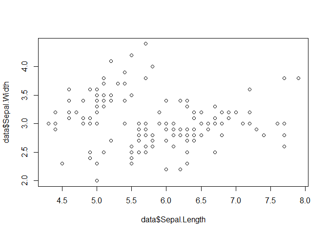

Demonstration of WORCS for SRA
================
19 January, 2022

This manuscript uses the Workflow for Open Reproducible Code in Science
(Van Lissa et al. 2020) to ensure reproducibility and transparency. All
code <!--and data--> are available at
<git@github.com:cjvanlissa/sra_demo.git>.

This is an example of a non-essential citation (Van Lissa et al. 2020).
If you change the rendering function to `worcs::cite_essential`, it will
be removed.

<!--The function below inserts a notification if the manuscript is knit using synthetic data. Make sure to insert it after load_data().-->

# Analysis

Below is a linear model with Sepal.Length and Sepal.Width:

    ##                Estimate Std. Error   t value     Pr(>|t|)
    ## (Intercept)   3.4189468 0.25356227 13.483658 1.552431e-27
    ## Sepal.Length -0.0618848 0.04296699 -1.440287 1.518983e-01

<!-- -->

Van Lissa, Caspar J., Andreas M. Brandmaier, Loek Brinkman, Anna-Lena
Lamprecht, Aaron Peikert, Marijn E. Struiksma, and Barbara Vreede. 2020.
“WORCS: A Workflow for Open Reproducible Code in Science,” May.
<https://doi.org/10.17605/OSF.IO/ZCVBS>.

